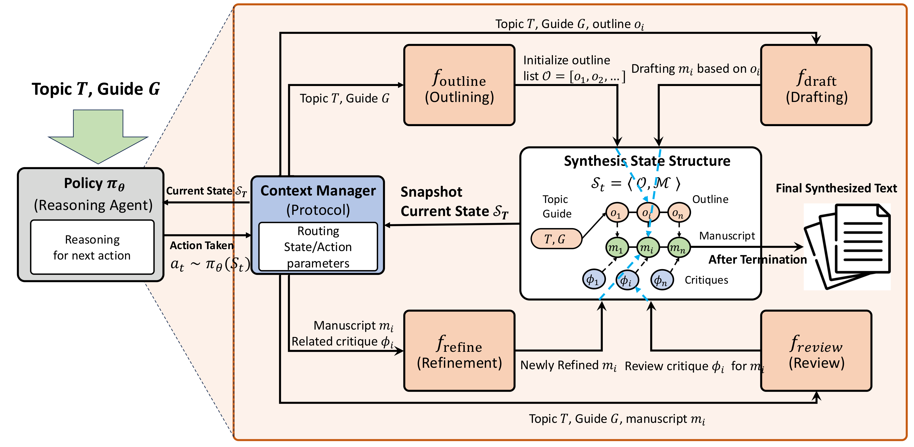
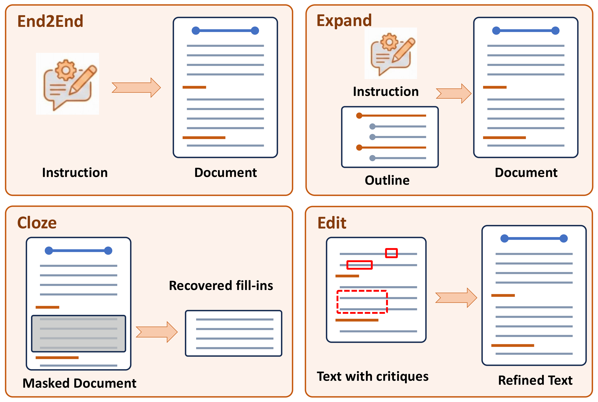
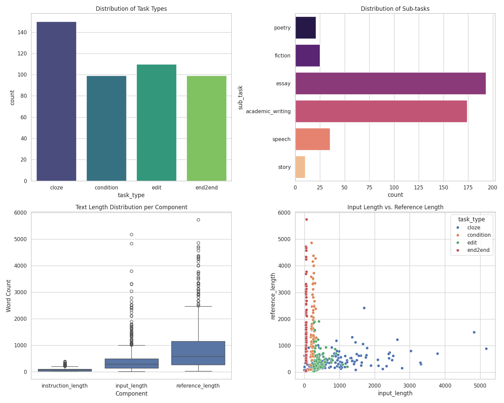

# RAVEL: Reasoning Agents for Validating and Evaluating LLM Text Synthesis

**A benchmark and agentic harness for controllable long-form writing.**

This repository contains two things:

- **C3EBench** — a benchmark for evaluating controllable, constrained writing across four
  task types (**Cloze**, **Expand**, **Edit**, **End-to-End**) in **English** and **Chinese**,
  with an LLM-judge scoring protocol.
- **RAVEL** — an agentic writing harness that turns a single model into a
  *plan → write → review → revise* loop, so its writing behaviour can be measured
  step-by-step rather than as a single black-box generation.

`ravel_bench/` is the unified, parameterized entry point for running both. Everything is
driven by CLI flags — the model under test, the judge model, the language, the action
protocol, and where results are written are all configurable, with no source edits required.

<p align="center">
  <br>
  <em>RAVEL — a reasoning-agent policy drives <code>outline → draft → review → refine</code> actions over a shared synthesis state, coordinated by a context manager, until it emits the final text.</em>
</p>

---

## Table of contents

- [Overview](#overview)
- [Repository structure](#repository-structure)
- [Installation](#installation)
- [API configuration](#api-configuration)
- [The C3EBench dataset](#the-c3ebench-dataset)
- [Usage](#usage)
  - [1. Inference](#1-inference)
  - [2. Evaluation](#2-evaluation)
  - [3. Results](#3-results)
- [Results](#results)
- [Reproducing the paper](#reproducing-the-paper)
- [Defaults](#defaults)
- [Citation](#citation)
- [License](#license)

---

## Overview

C3EBench probes writing ability under explicit constraints instead of open-ended prompting.
Each item pairs an instruction with structured inputs and a gold reference, across four
task types:

| Task | Code name | What the model must do |
|---|---|---|
| **Cloze** | `cloze` | Fill a gap given the surrounding text (prefix/suffix). |
| **Expand** | `condition` | Produce a full piece from a brief + a set of structural/content constraints. |
| **Edit** | `edit` | Revise an existing draft to satisfy a critique while staying grounded in source material. |
| **End-to-End** | `end2end` | Generate a complete piece from an instruction, genre, brief, audience, and length budget. |

Outputs are scored by an LLM judge against the reference and the task's rubric.

<p align="center">
  <br>
  <em>The four C3EBench task types — <strong>End2End</strong> (instruction → document), <strong>Expand</strong> (instruction + outline → document), <strong>Cloze</strong> (masked document → recovered fill-ins), and <strong>Edit</strong> (text + critiques → refined text).</em>
</p>

**RAVEL** wraps a model in an explicit multi-role writing process (planner, writer,
reviewer, revisor) so that *how* a model writes — how often it revises, when it stops,
how closely it tracks the reference — can be observed and ablated, not just the final text.

## Repository structure

```
.
├── ravel_bench/          # ← unified CLI: inference, evaluation, results (start here)
├── english_dataset/      # C3EBench English split + per-task schemas, stats, plots
├── chinese_dataset/      # C3EBench Chinese split + per-task schemas, stats, plots
├── llm_client.py         # provider-agnostic client (OpenAI / Anthropic SDKs)
├── core_agents.py        # RAVEL agent roles and writing loop (EN + shared)
├── core_agents_en.py     # English-specific agent variant
├── agent_prompts*.py     # RAVEL role prompts
├── evaluation_prompts.py # judge rubrics per (language, task)
├── local_logger.py       # run/trace logging
├── inference_results/     ┐
├── evaluation_results/    ├─ released run artifacts (read-only; see warning below)
├── ravel_results/         ┘
├── requirements.txt
└── step_*.py, util_*.py  # standalone scripts used to build the dataset and produce
                          #   the original figures; kept for provenance (not required
                          #   for normal use — prefer `ravel_bench`)
```

The `ravel_bench` package is an **additive** layer: it reuses `core_agents.py`,
`agent_prompts.py`, `evaluation_prompts.py`, and `local_logger.py` without modifying them,
so the released results remain reproducible.

## Installation

Requires **Python 3.10+**.

```bash
git clone <this-repo> && cd <this-repo>
python -m venv .venv && source .venv/bin/activate   # optional but recommended
pip install -r requirements.txt                     # openai, anthropic, tenacity, tqdm,
                                                    # pandas, numpy, scipy, matplotlib
```

All commands are run **from the repository root** so the shared modules are importable:

```bash
python -m ravel_bench <subcommand> ...
```

## API configuration

Model calls go through **`llm_client.make_client(model_name)`**, built directly on the
official **OpenAI** and **Anthropic** SDKs. Point it at any OpenAI- or Anthropic-compatible
endpoint via environment variables:

```bash
# OpenAI-compatible models
export RAVEL_OPENAI_BASE_URL="https://api.openai.com/v1"   # or your gateway
export OPENAI_API_KEY="sk-..."                             # or RAVEL_API_KEY

# Anthropic models  (model names matching claude* / anthropic:*)
export RAVEL_ANTHROPIC_BASE_URL="https://api.anthropic.com"
export ANTHROPIC_API_KEY="sk-ant-..."                      # or RAVEL_API_KEY
```

Routing is automatic by model name: `claude*` / `anthropic:*` → Anthropic Messages API;
`openrouter:*` → OpenAI SDK with streaming; otherwise → OpenAI `chat.completions`. Every
client exposes the same `get_api_result(messages, tools, temperature, max_completion_tokens)`
interface, so switching providers requires no code changes.

## The C3EBench dataset

The two splits live in `english_dataset/` and `chinese_dataset/`. Each has a `readme.md`
documenting the JSON schema for every task type, a `stat.csv` with length statistics, and
rendered figures under `*_plots/`.

<p align="center">
  <br>
  <em>C3EBench composition — task-type mix, sub-task domains, and instruction/reference length distributions (English split).</em>
</p>

| Split | File | Items (cloze / condition / edit / end2end) |
|---|---|---|
| English | `english_dataset/english_dataset.jsonl` | 150 / 99 / 110 / 99 |
| Chinese | `chinese_dataset/chinese_dataset_v2.jsonl` | 200 / 200 / 200 / 200 |

Each record shares a common shape (task-specific `input` fields vary — see the per-split
`readme.md`):

```json
{
  "infer_id":  "end2end_en_1",
  "task_type": "end2end",
  "sub_task":  "academic_writing",
  "instruction": "…what to write…",
  "input":     { "genre": "…", "brief": "…", "audience": "…", "word": 800 },
  "reference": "…gold-standard text…"
}
```

## Usage

`ravel_bench` has three subcommands. Common flags: `--lang {en,zh}` (aliases
`english`/`chinese`), `--limit N` (cap items for a smoke test), `--dry-run` (print the plan
and the number of API calls it *would* make, without calling anything), `--workers N`.

### 1. Inference

Run a model over the benchmark. `end2end` is direct single-shot generation; `ravel` runs the
agentic writing loop.

```bash
# Direct single-shot inference on the C3EBench tasks
python -m ravel_bench infer --mode end2end --lang en \
    --model_name gpt-5.2-2025-12-11 --output_dir runs/infer/en

# Agentic RAVEL inference (plan → write → review → revise)
python -m ravel_bench infer --mode ravel --lang en \
    --model_name qwen3-max-2025-09-23 --output_dir runs/ravel/en
```

**Action protocol & `tau` ablations.** A deterministic controller can replace the policy
model's action choice, so the writing protocol is fixed and comparable across models; the
writer/reviewer/revisor tools still run normally.

```bash
# forced pipeline: outline → draft → review → (revise up to max_revisions) → finish
python -m ravel_bench infer --mode ravel --lang en --model_name <M> --protocol fixed --tau 8

# ablate the review / refine stages
python -m ravel_bench infer --mode ravel --lang en --model_name <M> --protocol no_review
python -m ravel_bench infer --mode ravel --lang en --model_name <M> --protocol no_refine

# sweep the review threshold tau
for t in 6 7 8 9; do
  python -m ravel_bench infer --mode ravel --lang en --model_name <M> --protocol fixed --tau $t \
     --output_dir runs/ravel/en/tau_$t
done
```

**Per-role model substitution.** Assign different models to the reasoning and generation
roles to separate their contributions:
`--planner_model --writer_model --reviewer_model --revisor_model`.

### 2. Evaluation

Judge outputs with a configurable reward model. Running `eval` with two different
`--judge_model` values gives a cross-judge robustness comparison.

```bash
# Judge C3EBench inference outputs
python -m ravel_bench eval --mode c3ebench --lang en \
    --model_name gpt-5.2-2025-12-11 --judge_model <JUDGE> \
    --output_dir runs/eval/en

# Judge RAVEL final articles (English or Chinese).
# Run dirs are read read-only; a judge-tagged file is written so final_rating.json is never overwritten.
python -m ravel_bench eval --mode ravel --lang en \
    --root_dir ravel_results/english/gemini-3-pro-preview \
    --judge_model <JUDGE> --output_dir runs/ravel_eval/en
```

### 3. Results

Regenerate the main results table directly from `evaluation_results/` (not hand-copied):

```bash
python -m ravel_bench results --lang english   # or: --lang chinese
```

## Results

`results` computes per-model, per-task mean judge scores from `evaluation_results/<lang>/*.jsonl`.
The benchmark ships judged outputs for a broad model set (GPT, Gemini, Claude, Qwen, GLM,
DeepSeek, Kimi, Grok, Llama, and others). Example (English, abridged):

```
| Model                | Cloze | Expand | Edit | End2End |
| gemini-3-pro-preview | 4.44  | 7.79   | 7.18 | 7.51    |
| gpt-5.2-2025-12-11   | 4.53  | 7.89   | 7.50 | 7.37    |
| qwen3-max-2025-09-23 | 4.32  | 7.86   | 7.71 | 7.35    |
```

For the English split, when the RAVEL trajectory-analysis tables are present, the command
also appends agentic-dynamics columns per model (e.g. finish rate, trajectory length, and
alignment with the reference alongside the judge score), linking benchmark scores to writing
behaviour.

## Reproducing the paper

- **Main benchmark table** — each model is evaluated as its own policy: `infer --mode ravel
  --protocol autonomous` (no per-role overrides), then `eval`, then `results`.
- **Reasoner / generator substitution study** — use `--planner_model` / `--writer_model`
  (etc.) to swap the reasoning vs. generation model while holding the other fixed.
- **Protocol / `tau` ablations** — use `--protocol {fixed,no_review,no_refine}` and the
  `--tau` sweep shown above.

## Defaults

`tau = 8.0`, `max_steps (T_max) = 50`, `max_revisions_per_section = 3`,
inference temperature `0.7`, judge temperature `0.0`, default judge `gpt-5.2-2025-12-11`.
Task-name mapping: the code's `condition` task is reported as **Expand**.

### Released artifacts are read-only

`ravel_bench` refuses to write into `inference_results/`, `evaluation_results/`, or
`ravel_results/` (guarded by `config.assert_not_protected`) — these are the only record of
the published runs. Always point `--output_dir` at a fresh directory outside them (the
examples above use `runs/`).

## Citation

This repository is released for anonymous peer review. Citation details will be added upon
publication.

## License

Released under the **Apache License 2.0** — see [`LICENSE`](LICENSE).
